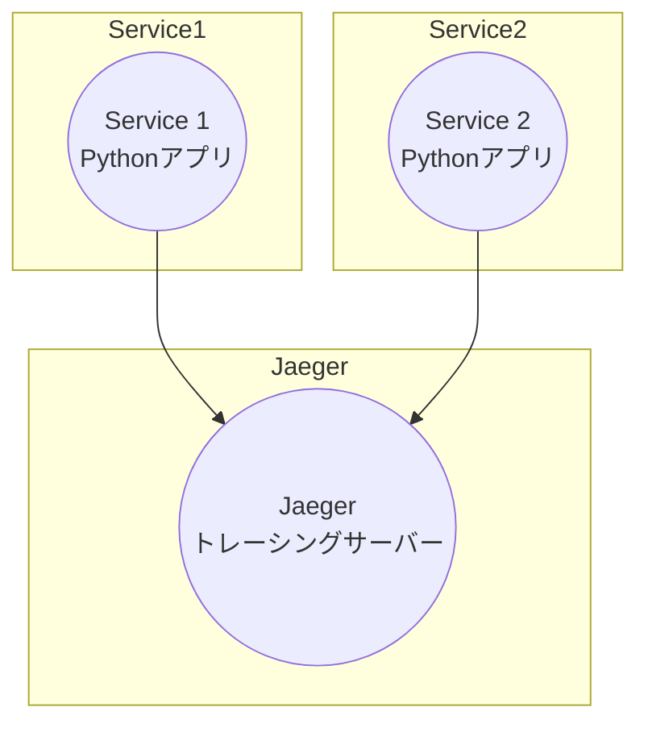

# OpenTelemetry Playground

このリポジトリはOpenTelemetryとJaegerの実験と学習のためのプレイグラウンドです。特に、Receiver、Exporter、Processorの複数の構成を用いて通信の学習を行います。


## システム構成



## 必要なツール

- Docker

## セットアップ

1. リポジトリをクローンします。

    ```bash
    git clone https://github.com/shuhei-fujita/playground-opentelemetry.git
    cd playground-opentelemetry
    ```

    ```
    pip install -r requirement.txt
    ```

2. Dockerコンテナを起動します。

    ```bash
    docker-compose up
    ```

## 設定ファイルの構成

- `config.yaml`: OpenTelemetry Collectorの設定ファイル
- `docker-compose.yaml`: Docker Compose設定ファイル

## コンポーネント構成

### Receivers

- OTLP Receiver: OpenTelemetry Protocolでデータを受信
- Jaeger Receiver: Jaegerからデータを受信

### Exporters

- Jaeger Exporter: Jaegerにデータを送信
- Console Exporter: コンソールにデータを出力

### Processors

- Batch Processor: データをバッチ処理
- Queue Processor: データをキューに入れる

### Agent/Collector

- 受信、加工、送信を一元管理するコンポーネント

## 通信プロトコル

- OTLP (OpenTelemetry Protocol): OpenTelemetryで標準とされるプロトコル
- gRPC: 高性能、オープンソースのRPCフレームワーク
- HTTP

## 複数のコンポーネントでの通信

このセクションでは、複数のReceiver、Exporter、Processorを用いて通信を行います。

1. OTLP ReceiverとJaeger Exporterの連携

    ```bash
    # config.yaml
    receivers:
      otlp:
    exporters:
      jaeger:
        endpoint: "localhost:14250"
    ```

2. Jaeger ReceiverとConsole Exporterの連携

    ```bash
    # config.yaml
    receivers:
      jaeger:
    exporters:
      logging:
        loglevel: debug
    ```

## Jaeger UIにデータを流し込む方法

1. Pythonスクリプト`push-logs-to-metrics.py`を実行すると、データはOpenTelemetry Collectorに送信されます。
2. OpenTelemetry CollectorがJaegerにデータを転送します。
3. ブラウザで`http://localhost:16686`にアクセスしてJaeger UIを開きます。
4. "Service" ドロップダウンから適切なサービスを選択し、"Find Traces" ボタンをクリックします。

## 参考

- [OpenTelemetry Collector GitHub](https://github.com/open-telemetry/opentelemetry-collector)
- [Jaeger GitHub](https://github.com/jaegertracing/jaeger)
